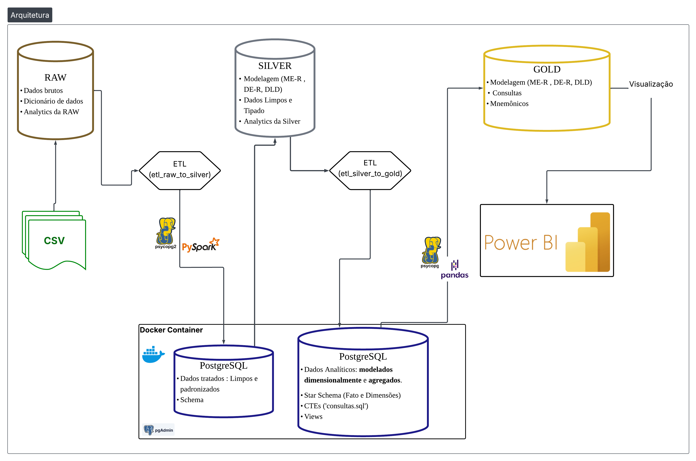

# Análise de Atrasos de Voos em Aeroportos

<div align="center">


[](https://github.com/MateuSansete/Airbnb_analytics)
[](https://mateusansete.github.io/Airbnb_analytics/)
[](https://miro.com/app/board/uXjVGSwQ8Ok=/?share_link_id=465202330329)

</div>

---

**ETL pipeline seguindo a arquitetura Medallion (Bronze, Silver, Gold) para análise de dados sobre atrasos de voos em aeroportos dos Estados Unidos.**

---

## Arquitetura

<div align="center">

</div>

### Objetivos

O projeto implementa um **pipeline ETL** utilizando a **Arquitetura Medallion** para análise de dados históricos de atrasos de voos nos Estados Unidos. Os principais objetivos são:

- **Arquitetura Lakehouse**: Implementar camadas Bronze (Raw), Silver (Curated) e Gold (Aggregated) para armazenamento e processamento otimizado

- **Modelagem de Dados**: Desenvolver representações conceitual (MER), lógica (DER) e física (DDL) do modelo de dados

- **Banco de Dados**: Construir e popular um banco PostgreSQL containerizado para consultas eficientes

- **Dashboard Analítico**: Desenvolver painéis interativos no Power BI para exploração de dados e geração de insights sobre:
  - Atrasos de voos por companhia aérea
  - Causas de atrasos (meteorologia, companhia, NAS, segurança, aeronave)
  - Padrões de sazonalidade
  - Cancelamentos e desvios
  - Tendências temporais

### Fonte de Dados

**Dataset**: Airline Delay and Cancellation Data (2013-2023)  
**Licença**: U.S. Government Works  
**Tamanho**: 28.73 MB | **Atualização**: Anual 

Os dados são provenientes do **Bureau of Transportation Statistics (BTS)** do governo dos Estados Unidos, disponibilizados no Kaggle. O dataset cobre o período de **agosto de 2013 a agosto de 2023** (10 anos de dados históricos) e fornece informações granulares sobre performance operacional de companhias aéreas em aeroportos dos EUA.

#### Estrutura do Dataset

O dataset possui **formato tabular** com **21 colunas** organizadas por combinações únicas de ano, mês, companhia aérea e aeroporto:

**Dimensões Temporais e Identificadores:**
- `year`, `month` - Dimensões temporais
- `carrier`, `carrier_name` - Código e nome da companhia aérea
- `airport`, `airport_name` - Código e nome do aeroporto

**Métricas Operacionais:**
- `arr_flights` - Total de voos de chegada
- `arr_del15` - Voos atrasados ≥15 minutos
- `arr_cancelled` - Voos cancelados
- `arr_diverted` - Voos desviados

**Contagem de Atrasos por Causa:**
- `carrier_ct` - Atrasos devido à companhia aérea
- `weather_ct` - Atrasos devido a condições meteorológicas
- `nas_ct` - Atrasos devido ao NAS (National Airspace System)
- `security_ct` - Atrasos devido a segurança
- `late_aircraft_ct` - Atrasos devido a aeronave atrasada

**Tempo de Atraso por Causa (minutos):**
- `arr_delay` - Tempo total de atraso de chegada
- `carrier_delay` - Tempo de atraso atribuído à companhia
- `weather_delay` - Tempo de atraso atribuído ao clima
- `nas_delay` - Tempo de atraso atribuído ao NAS
- `security_delay` - Tempo de atraso atribuído à segurança
- `late_aircraft_delay` - Tempo de atraso atribuído a aeronave atrasada

#### Casos de Uso

Este dataset permite realizar:

**Análise de Performance**: Avaliar pontualidade de companhias em aeroportos específicos  
**Identificação de Tendências**: Descobrir padrões sazonais e períodos críticos  
**Análise de Causa-Raiz**: Investigar os principais fatores de atrasos  
**Benchmarking**: Comparar performance entre companhias e aeroportos  
**Modelagem Preditiva**: Desenvolver modelos de previsão de atrasos  
**Insights Estratégicos**: Informar decisões operacionais e estratégias de mitigação
<!--

Para mais detalhes veja a documentação:

## Documentação

**Site de Documentação**: [https://mateusansete.github.io/Airbnb_analytics/](https://mateusansete.github.io/Airbnb_analytics/)

A documentação completa inclui:
- Estrutura das camadas Bronze, Silver e Gold
- Pipeline ETL detalhado
- Modelagem de dados e schema do banco
- Guia de instalação e execução
- Análises e visualizações implementadas

## Dashboard Power BI
-->
**Em desenvolvimento** - Dashboard interativo para análise de atrasos de voos

**Páginas e Features Planejadas:**

**Overview (KPIs Principais)**
- Total de voos, taxa de atrasos ≥15min, cancelamentos e desvios
- Performance geral do setor aéreo (2013-2023)
- Principais métricas comparativas

**Análise por Companhia Aérea**
- Ranking de performance (pontualidade, cancelamentos)
- Comparativo entre carriers (benchmarking)
- Volume operacional vs. eficiência

**Análise de Causas de Atrasos**
- Breakdown das 5 causas (Carrier, Weather, NAS, Security, Late Aircraft)
- Contribuição relativa e absoluta de cada fator
- Análise de causa-raiz por companhia e aeroporto

**Análise Temporal e Sazonalidade**
- Tendências anuais e mensais
- Padrões sazonais e períodos críticos
- Evolução histórica da performance

**Análise por Aeroporto**
- Performance dos principais hubs
- Comparativo geográfico
- Aeroportos mais afetados por cada tipo de atraso

---

## Como Executar

### Pré-requisitos

- Python 3.8+
- Docker e Docker Compose
- Jupyter Notebook
- PostgreSQL (via Docker)
- psycopg2-binary (conexão Python-PostgreSQL)

### 1. Clone o repositório

```bash
git clone https://github.com/MateuSansete/Airbnb_analytics.git
cd Airbnb_analytics
```

### 2. Instale as dependências

```bash
pip install -r requirements.txt
```

### 3. Inicie o banco de dados PostgreSQL

```bash
docker-compose up -d
```

Aguarde alguns segundos para o container inicializar. Verifique o status:

```bash
docker-compose ps
```

### 4. Execute o pipeline ETL

Abra o Jupyter Notebook:

```bash
jupyter notebook
```

Execute os notebooks na seguinte ordem:
1. `Transformer/etl_raw_to_silver.ipynb` - Processa dados brutos para a camada Silver
2. `Data Layer/silver/analytics.ipynb` - Gera análises e visualizações
<!---
### 5. Visualize a documentação localmente

```bash
mkdocs serve
```

Acesse: `http://localhost:8000`

---

## Estrutura do Projeto

```
Airbnb_analytics/
├── Data Layer/
│   ├── gold/                       # Camada Gold (agregações e métricas)
│   │   ├── consultas.sql          # Consultas analíticas
│   │   ├── ddl.sql                # Definição do schema gold
│   │   ├── mer_der_dld.pdf        # Modelagem de dados
│   │   └── mnemonico.pdf          # Dicionário mnemônico
│   ├── raw/                        # Camada Bronze (dados brutos)
│   │   ├── analytics.ipynb        # Análise exploratória dos dados brutos
│   │   ├── dados_brutos.csv       # Dataset original do Kaggle
│   │   └── dicionario_de_dados.pdf # Documentação do dataset
│   └── silver/                     # Camada Silver (dados limpos)
│       ├── analytics.ipynb        # Análises da camada silver
│       ├── ddl.sql                # Definição do schema silver
│       └── mer_der_dld.pdf        # Modelagem de dados silver
├── Transformer/
│   ├── etl_raw_to_silver.ipynb    # Pipeline ETL Bronze → Silver
│   └── etl_silver_to_gold.ipynb   # Pipeline ETL Silver → Gold
├── docs/                           # Documentação MkDocs
│   ├── index.md
│   ├── assets/
│   └── pages/
│       ├── entrega0/              # Base de Dados
│       ├── entrega1/              # Raw → Silver
│       ├── entrega2/              # Gold Layer
│       └── entrega3/              # Power BI
├── site/                           # Site estático gerado pelo MkDocs
├── docker-compose.yml              # Configuração do PostgreSQL
├── Dockerfile                      # Imagem Docker do projeto
├── requirements.txt                # Dependências Python
├── mkdocs.yml                      # Configuração da documentação
└── README.md
```
--->

---

## Tecnologias Utilizadas

| Categoria | Tecnologias |
|-----------|-------------|
| **Processamento de Dados** |   |
| **Banco de Dados** |    |
| **Visualização** |    |
| **Machine Learning** |   |
| **Desenvolvimento** |    |
| **Documentação** |   |

---

## Licença

Este projeto é parte de uma atividade acadêmica da disciplina de **Sistemas de Banco de Dados 2** da **Universidade de Brasília (UnB)**.

**Instituição**: Faculdade de Ciências e Tecnologias em Engenharia (FCTE)  
**Curso**: Engenharia de Software  
**Período**: 2025.4


</div>
