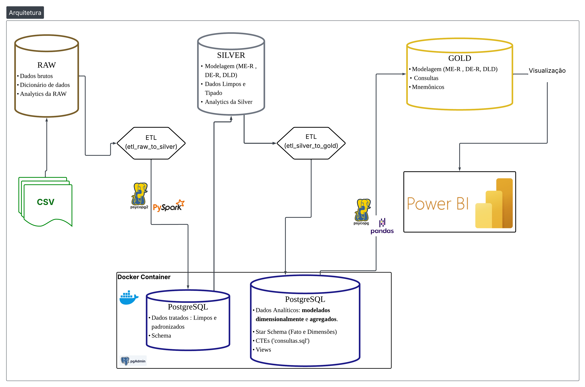

# Análise de Atrasos de Voos em Aeroportos

<div align="center">


[](https://github.com/MateuSansete/Airbnb_analytics)
[](https://mateusansete.github.io/Airbnb_analytics/)
[](https://miro.com/app/board/uXjVGSwQ8Ok=/?share_link_id=465202330329)

</div>

---

**ETL pipeline seguindo a arquitetura Medallion (Bronze, Silver, Gold) para análise de dados sobre atrasos de voos em aeroportos dos Estados Unidos.**

---

## Arquitetura

<div align="center">

</div>

### Sobre o projeto

O projeto implementa um **pipeline ETL** utilizando a **Arquitetura Medallion** para análise de dados históricos de atrasos de voos nos Estados Unidos. Os principais objetivos são:

- **Arquitetura Lakehouse**: Implementa camadas Bronze (Raw), Silver (Curated) e Gold (Aggregated) para armazenamento e processamento otimizado

- **Modelagem de Dados**: Representações conceitual (MER), lógica (DER) e física (DDL) do modelo de dados

- **Banco de Dados**: Constrói e popula um banco PostgreSQL containerizado para consultas eficientes

- **Dashboard Analítico**: painéis interativos no Power BI para exploração de dados e geração de insights sobre:
  - Atrasos de voos por companhia aérea
  - Causas de atrasos (meteorologia, companhia, NAS, segurança, aeronave)
  - Padrões de sazonalidade
  - Cancelamentos e desvios
  - Tendências temporais

### Fonte de Dados

**Dataset**: [Airline Delay and Cancellation Data (2013-2023)](https://www.kaggle.com/datasets/sriharshaeedala/airline-delay)
**Licença**: U.S. Government Works  
**Tamanho**: 28.73 MB | **Atualização**: Anual 

Os dados são provenientes do **Bureau of Transportation Statistics (BTS)** do governo dos Estados Unidos, disponibilizados no Kaggle. O dataset cobre o período de **agosto de 2013 a agosto de 2023** (10 anos de dados históricos) e fornece informações granulares sobre performance operacional de companhias aéreas em aeroportos dos EUA.

##  O Dataset
Os dados originais compreendem 10 anos de histórico operacional (2013-2023). A modelagem transformou o formato tabular original em um esquema analítico:

* **Dimensões:** Temporal (Ano/Mês), Geográfica (Aeroportos) e Organizacional (Companhias Aéreas).
* **Métricas (Fatos):** Contagem de voos, cancelamentos, desvios e 5 categorias específicas de causas de atraso (Carrier, Weather, NAS, Security, Late Aircraft).


## Inteligência de Dados e Analytics

O dashboard final foi estruturado para responder perguntas críticas de negócio, organizadas em 4 pilares principais:

* **Executive Overview:** KPIs globais de volume, taxa de atraso e cancelamentos (2013-2023).
* **Root Cause Analysis:** Decomposição técnica das causas de atraso (Weather, Carrier, NAS, Security, Late Aircraft).
* **Benchmarking Operacional:** Ranking de performance por Companhia Aérea e análise de eficiência por Hub (Aeroporto).
* **Time Series & Sazonalidade:** Identificação de períodos críticos e tendências históricas de performance.

---

## Como Executar o projeto

### Pré-requisitos

- Python 3.8+
- Docker e Docker Compose
- Jupyter Notebook
- PostgreSQL (via Docker)
- psycopg2-binary (conexão Python-PostgreSQL)

### 1. Clone o repositório

```bash
git clone https://github.com/MateuSansete/Airbnb_analytics.git
cd Airbnb_analytics
```

### 2. Instale as dependências

```bash
pip install -r requirements.txt
```

Recomenda-se o uso de ambiente virtual:

```bash
python -m venv venv
source venv/bin/activate  # Linux / Mac
```
# venv\Scripts\activate   # Windows


### 3. Inicie o banco de dados PostgreSQL

```bash
docker-compose up -d
```

Aguarde alguns segundos para o container inicializar. Verifique o status:

```bash
docker-compose ps
```

### 4. Execute o pipeline ETL

Abra o Jupyter Notebook:

```bash
jupyter notebook
```

Execute os notebooks na seguinte ordem:
1. `Transformer/etl_raw_to_silver.ipynb` - Processa dados brutos para a camada Silver
2. `Data Layer/silver/analytics.ipynb` - Gera análises e visualizações


---

## Estrutura do Projeto

```
Airbnb_analytics/
├── assets/                 # Recursos visuais e diagramas do projeto
├── DataLayer/              # Camadas da Arquitetura Medallion
│   ├── gold/               # Camada Gold: Modelagem dimensional e scripts finais
│   │   ├── ddl.sql
│   │   ├── mer_der_dld_gold.pdf
│   │   ├── mnemonicos.pdf
│   │   └── starschema.pdf
│   ├── raw/                # Camada Bronze: Dados brutos e dicionários
│   │   ├── analytics.ipynb
│   │   ├── dados_brutos.csv
│   │   └── dicionario_de_dados.pdf
│   └── silver/             # Camada Silver: Dados limpos e modelagem intermediária
│       ├── analytics.ipynb
│       ├── ddl.sql
│       └── mer_der_dld.pdf
├── Transformer/            # Processamento e scripts de ETL
│   └── etl_raw_to_silver.ipynb
├── docker-compose.yml      # Infraestrutura PostgreSQL via Docker
├── LICENSE                 # Licença do projeto
├── README.md               # Documentação principal
└── requirements.txt        # Dependências do ambiente Python
```


## Tecnologias Utilizadas

| Categoria | Tecnologias |
|-----------|-------------|
| **Processamento de Dados** |   |
| **Banco de Dados** |    |
| **Visualização** |    |
| **Machine Learning** |   |
| **Desenvolvimento** |    |
| **Documentação** |   |

---

## Licença

GPL 3.0


</div>
